# **Output for 1.c is:**

> Program to print first N Natural Numbers using while loop  

> 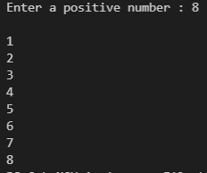

 

---

# **Output for 2.c is:**

> Program to display the message 5 times as displayed below using for loop and continue statement.

> 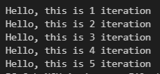

 

---

# **Output for 3.c is:**

> Program to perform division by zero and display appropriate warning message using goto statement

> 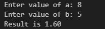
> 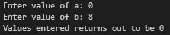

 

---

# **Output for downpyramid.c is:**

> 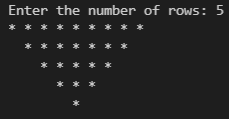

---

# **Output for incometax.c is:**

> 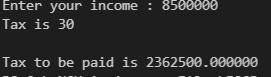

 

---

# **Output for n_pyramid.c is:**

> 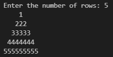

 

---

# **Output for practice1.c is:**

> 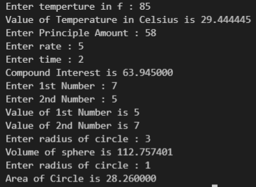

 

---

# **Output for practice2.c is:**

> 1.  Write a program to print ASCII value of the character.
> 2. Write a program to swap two numbers without using third variable.
> 3. Write a program to add two integers entered by the user.
> 4.  Write a program to find the size of int, float, double and char

 

> 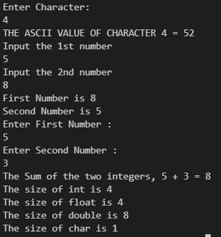

 

---

# **Output for practice4.c is:**

> 1.    Write a program to print whether a number entered by user is even or odd.
> 2.    Write a program to print whether a number entered by user is greater than 100 or not.
> 3.    Write a program to print whether a number entered by user is multiple of 5 or not.
> 4.    Write a program to print roots of a quadratic equation.
> 5.    Write a program to find whether a student is pass or not.

 

> 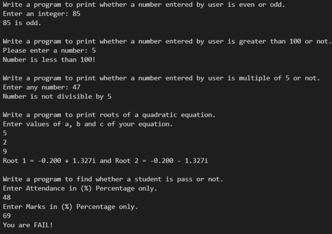

 

---

# **Output for practice5.c is:**

> Pattern Questions

 

> 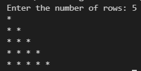
> 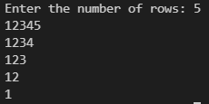
> 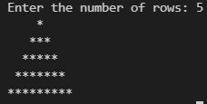
> 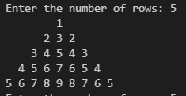
> 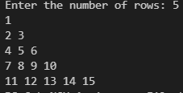

 

---

# **Output for prime_number.c is:**

> Prime number

 

> 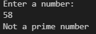

 

---

# **Output for practice8_1.c**

> 1. Write a program in C to print the sum of first n natural numbers.  
> Definition of Done:
> a) The program should ask the user to enter the value of n (positive integer). If not positive, ask the user to input appropriate value.
> b) The program should use while, do-while and for loop. 

 

> 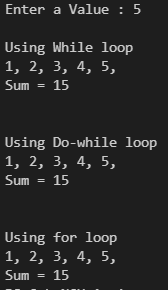

 

---

# **Output for practice8_2.c**

> Pattern Question

 

> 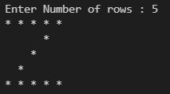

 

---